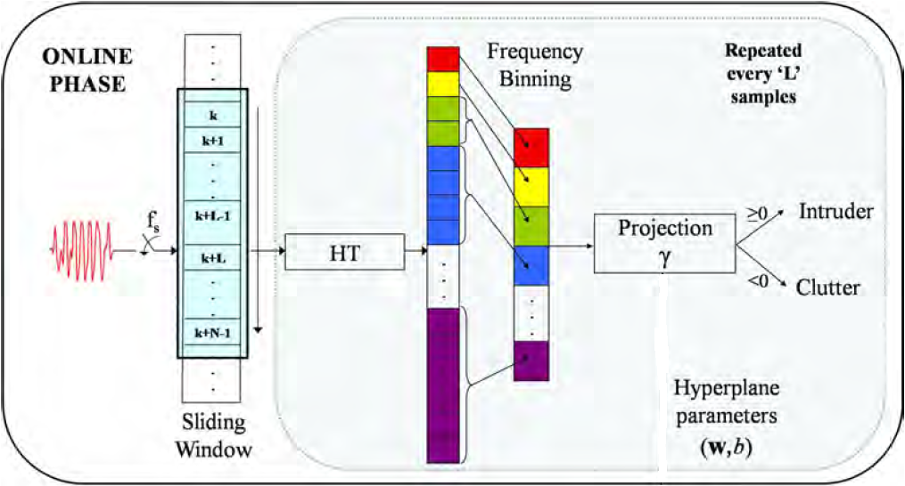

# Human-Intrusion-Detect
Source Code for the Intrusion Detection Algorithm & Analytical Modeling of PIR Sensor. `IntrusionDetectionAlgorithm.c` implements the online phasse of Intrusion Detection Algorithm (shown in Figure below).

We suggest the user refer to the publication/masters thesis for implementation details.  
Please feel free to use the code in your research and development works. We would appreciate a citation to the paper below when this code is helpful in obtaining results in your future publications.  
**Publication for citation:** 
(1) Abu Sajana R., R. Subramanian, P. Vijay Kumar, Syam Krishnan, Bharadwaj Amrutur, Jeena Sebastian, Malati Hegde, S. V. R. Anand, 
"A Low-Complexity Algorithm for Intrusion Detection in a PIR-Based Wireless Sensor Network,"
In 5th International Conference on Intelligent Sensors, Sensor Networks and Information Processing (ISSNIP), pages 337–342, Dec 2009.  
(2) The SmartDetect WSN Team, "SmartDetect: An efficient WSN implementation for intrusion detection," 
Communication Systems and Networks (COMSNETS), 2010 Second International Conference on, Bangalore, 2010, pp. 1-2.  
Please find my masters thesis [here](https://sites.google.com/site/sramanathan77/M.Sc.%28Engg.%29Thesis.pdf?attredirects=0) and my thesis defense slides [here](https://sites.google.com/site/sramanathan77/defense_slides.pdf?attredirects=0).

**A Low-Complexity Algorithm for Intrusion Detection in a PIR-Based Wireless Sensor Network** 
• Investigated the problem of detecting a human intruder in the presence of  clutter arising from wind-blown vegetation in a passive infra-red (PIR) based wireless sensor network (WSN). 
• Proposed a low-complexity algorithm based on a combination of Haar Transform (HT) and Support Vector Machine (SVM) based training. Extensive field testing of the algorithm was done. The algorithm exhibited a very good performance.

**Analytical Model For Intruder Signature** 
• Goal was to come up with a model for the intruder signature. 
• Provided a closed-form expression for a good approximation to the intruder waveform. 
•	Developed, for the first time in literature, a model for the PIR sensor’s signature. 
• Used this to determine how to optimally place multiple sensing nodes so as to estimate the path of the intruder in motion.
